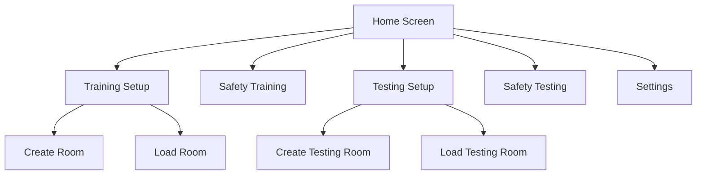
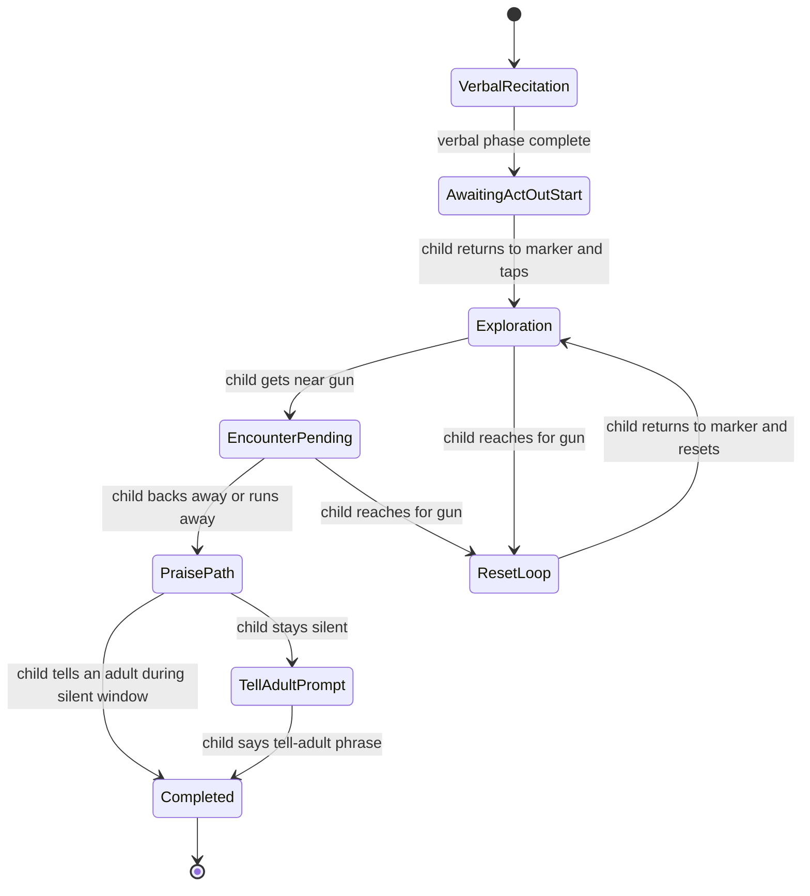
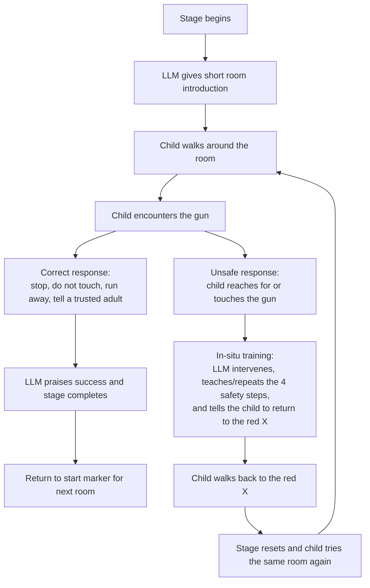
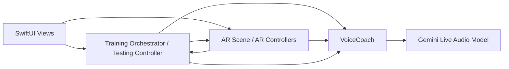
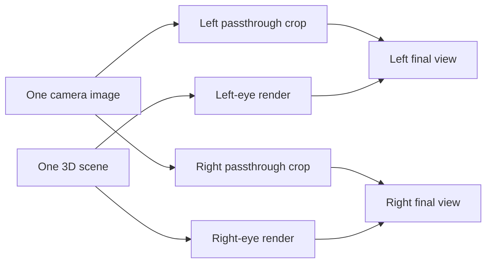

# Child Firearm Safety App: How It Works

A structured overview of how the app teaches firearm safety, runs staged assessments, coordinates AR and voice systems, and persists reusable room setups.

**Tags:** `Training Setup`, `Safety Training`, `Testing Setup`, `Safety Testing`, `AR + Voice Architecture`

## Contents
1. [Purpose](#purpose)
2. [App Overview](#app-overview)
3. [Main User Flows](#main-user-flows)
4. [Core Runtime Architecture](#core-runtime-architecture)
5. [The Voice System](#the-voice-system)
6. [The AR System](#the-ar-system)
7. [Regular Mode vs Stereo Mode](#regular-mode-vs-stereo-mode)
8. [Data Persistence](#data-persistence)
9. [Settings](#settings)
10. [Important Design Characteristics](#important-design-characteristics)
11. [End-to-End Summary](#end-to-end-summary)

---

## Purpose
This app teaches and assesses firearm safety behaviors in an AR environment using saved room setups, a live Gemini voice coach, and event-driven session control.

## App Overview
The app exposes four main user-facing work areas plus a settings screen.

1. `Training Setup`
2. `Safety Training`
3. `Testing Setup`
4. `Safety Testing`

Settings control display mode, recording behavior, knowledge retrieval mode, and Gemini API key storage.

## Main User Flows

### Training Setup
Training setup is used to create or load a real AR room for guided safety instruction.
* Scan the physical room until mapping is stable.
* Place a table in AR.
* Auto-place the gun on that table.
* Mark the child’s starting position with a floor marker.
* Save the room for later reuse.

Load mode restores a previously saved `ARWorldMap` and prepares the room for training.

### Safety Training
Safety Training is the guided teaching mode. It has two runtime phases.
* `Phase 1: Verbal Recitation`
* `Phase 2: Act-Out`

In verbal recitation, the child practices the four safety rules:
1. Stop
2. Don't touch it
3. Run away
4. Tell a trusted adult

When the model signals that the child has completed the verbal phase, the app transitions to the practice-the-steps phase.

In practice-the-steps, the child physically demonstrates the safety sequence in the AR environment. If the child reaches for the gun, the app enters a reset loop and requires another attempt from the start marker.

### Testing Setup
Testing Setup creates a reusable assessment environment rather than a single table-and-gun placement.
* Kitchen
* Garage
* Bedroom

The facilitator scans the room, places staged room assets against the environment, confirms those placements, and saves the testing room.

### Safety Testing
Safety Testing runs three staged scenarios in sequence using the saved testing room.
1. Kitchen
2. Garage
3. Bedroom

For each stage, the coach gives a short cover-story introduction and then stays mostly silent unless the child asks a question or does something unsafe.

If the child reaches for the gun, the stage enters an in-situ correction and reset loop. If the child runs away but does not tell a trusted adult, the system waits and then prompts for the missing final step.

The same stage pattern repeats across kitchen, garage, and bedroom. The diagram below shows one room cycle.

## Core Runtime Architecture
The app is built from three cooperating layers:
* SwiftUI views for navigation, overlays, and state-driven presentation
* AR controllers for world tracking, object placement, and physical behavior detection
* Voice/AI services for live conversation, intent handling, and completion signaling

The main coordination mechanism between these layers is a `NotificationCenter` event bus.

## The Voice System
`VoiceCoach` is the center of the voice stack. It starts sessions, manages permissions, streams microphone audio to Gemini Live, plays streamed audio back to the user, and translates model tool calls into runtime events.

### Conversation Loop
1. The app configures the audio session.
2. The microphone streams live audio to Gemini.
3. Gemini returns audio plus tool calls.
4. The app stops mic capture while the model is speaking to reduce feedback.
5. After playback ends, listening resumes.

### Tool-Driven Milestones
The runtime uses tool calls instead of fragile text matching for key state transitions.
* Verbal training completion
* Full training completion
* Testing stage completion
* Intent detection such as asking about the object or telling an adult

### Knowledge Retrieval
The coach can inject retrieval-based guidance from the bundled knowledge base.
* `Semantic` retrieval when a Gemini API key is available
* `TF-IDF` retrieval when local-only mode is enabled or embeddings are unavailable

## The AR System
The AR stack handles world tracking, room save/load, object placement, marker handling, proximity detection, retreat tracking, and hand-pose detection for reach gestures.

### Training AR Behavior
* Detects when the child gets near the gun
* Detects reaching toward the gun
* Detects backing away or running away
* Detects arrival at the start marker
* Processes tap-to-begin and tap-to-reset actions

These events are posted to the training orchestrator, which decides how the coach and AR scene should respond.

### Testing AR Behavior
* Tracks the active testing stage
* Handles marker-based reset and stage advancement
* Checks start-position alignment between rooms
* Uses similar reach and retreat detection with stage-specific control flow

## Regular Mode vs Stereo Mode
The app supports two different display pipelines, and they are architecturally different rather than being simple visual variants of the same renderer.

### Regular Mode
Regular mode is the straightforward AR path. It uses `RealityKit` through a standard `ARView`-based container.
* `ARViewContainer` creates the main `RealityKit` view
* `ARCoordinator` handles placement, save/load, gesture detection, and runtime events
* The user sees a single camera view with virtual content composited directly by RealityKit

This is the most native and visually faithful rendering path in the app.

### Stereo Mode
Stereo mode is a custom headset-oriented pipeline built for cardboard-style viewing. It does not use RealityKit for final presentation.
* One shared `ARKit` session
* `SceneKit` for the scene and per-eye camera nodes
* `Metal` for GPU-accelerated camera passthrough
* A custom cardboard mask and reticle overlay

The screen is split into left and right halves. The live camera feed is rendered into both halves, and the 3D scene is rendered separately for each eye on top.

### Key Limitation: One Real Camera
The stereo mode still depends on a single physical device camera. It is not true binocular capture.
* There are not two independent real-world camera viewpoints.
* There is no true left/right real-world disparity like a dedicated stereoscopic camera rig.
* The passthrough background cannot perfectly match what each human eye would naturally see.

Instead, the app creates a stereo approximation by rendering the same camera feed twice with different horizontal cropping and shifting, then matching the 3D projection to those shifted views.

### How the Stereo Mode Is Optimized
Even with a monocular source camera, the implementation tries to make the result feel as coherent and comfortable as possible.
* It renders the camera feed separately for each eye with a configurable horizontal stereo offset.
* It applies asymmetric per-eye projection matrices so virtual objects align with the shifted camera views.
* It keeps a separate unshifted detection camera for Vision and gesture math so hand tracking stays aligned with the original camera space.
* It uses a configurable zero-parallax distance so content can be tuned closer to screen depth instead of appearing overly separated.
* It uses Metal for the passthrough path so the stereo split stays efficient enough for realtime use.
* It layers person segmentation and depth-aware occlusion on top so real people can appear in front of virtual objects when the depth data supports that.

One important implementation detail is that the left and right virtual eye nodes are kept at the same physical position, while the projection matrices are shifted. In practice, the effect comes from projection and frustum manipulation plus per-eye camera cropping, not from two truly separated captured viewpoints.

**What Stereo Mode Improves:** Better immersion for a headset, stronger 3D separation for virtual content, and a presentation that works much better than a flat left-right screen split.

**What Stereo Mode Cannot Fully Reproduce:** Perfect real-world binocular depth, because the passthrough ultimately originates from one camera only.

So regular mode is the cleaner and more native AR path, while stereo mode is a carefully tuned custom approximation that gets as close as possible within the constraints of a single phone camera.

## Data Persistence
### Training Rooms
Training rooms are stored as `ARWorldMap` files in the app's documents directory.
* `room_<roomId>.arworldmap`

These maps are used to relocalize and restore saved anchors later.

### Testing Rooms
Testing rooms use a two-part persistence model:
* `testing_<roomId>.arworldmap`
* `testing_<roomId>_assets.json`

The JSON file stores asset transforms, optional start-camera alignment data, and versioned metadata.

## Settings
The settings screen exposes a small operational control surface for the app.
* **Cardboard Viewer Mode**: Swaps the normal presentation for stereo rendering suitable for a cardboard-style headset.
* **Record Training and Testing**: Enables automatic session recording. Standard mode uses screen recording; cardboard uses the stereo-capable path.
* **Local Only (TF-IDF)**: Lets the app stay local-only with TF-IDF or use semantic retrieval when Gemini embeddings are available.
* **Gemini API Key**: Stored locally on-device and used for live Gemini interactions and semantic retrieval support.

## Important Design Characteristics
1. Training and testing are intentionally separate. Training teaches; testing observes and intervenes only when necessary.
2. The event bus keeps AR, voice, and flow control loosely coupled.
3. Reset loops are part of the intended product behavior, not error recovery.
4. Saved rooms are a core capability that make repeated sessions practical.

## End-to-End Summary
In practice, the app works like this:
1. A facilitator creates and saves a room.
2. The app reloads that room and relocalizes the AR content.
3. A child moves through a guided or tested safety scenario.
4. The AR system detects what the child physically does.
5. The voice model reacts in real time based on those actions.
6. The session controller advances, resets, or completes the scenario.

# Robot Training Module

The Robot Training Module is a separate subsystem designed to deliver interactive firearm safety lessons using a physical physical NAO robot. It bridges real-time voice recognition, a RAG-augmented LLM, and the robot's native hardware to create conversational roleplay scenarios for children.

## Grade-Specific Curricula
The module includes tailored lesson scripts for different age groups:
* **Kindergarten** (`kindergarten_script_server.py`): Features "The Bushes" story, focusing on basic recognition and immediate avoidance.
* **1st Grade** (`1st_grade_script_server.py`): Features "The Box" story, adding context about safety jobs (police, military).
* **2nd Grade** (`2nd_grade_script_server.py`): Features "Andrew's Big Surprise" story, introducing scenarios within a home environment.

Across all grades, the core objective is teaching the children to physically and verbally practice the four rules: *Stop, Do not touch, Run away, Tell a grown-up*.

## Module Architecture

The system operates on a Client-Server model communicating over a ZeroMQ (`zmq`) network bridge. 

#### 1. The Server (Python 3 AI Engine)
The server runs locally on a PC and manages the lesson state, audio capture, and AI generation. 
* **Audio Capture:** Uses the `speech_recognition` library to record the child's answers via the computer microphone and transcribes them using Google Speech-to-Text.
* **RAG Knowledge Base:** Loads a local embeddings database (`RAGDocuments.json`) containing research documents. It performs cosine similarity searches to retrieve context relevant to the child's answers.
* **LLM Evaluation:** Sends the transcribed text, the lesson's grading criteria, and the retrieved RAG context to a `gemini-2.5-flash-lite` model. The model acts as "Journey" the robot, reflecting on the child's answer and gently correcting them if necessary.

#### 2. The Client (Python 2 NAOqi Bridge)
The client connects the AI server to the physical NAO robot.
* **Connection:** Uses the `naoqi` library (`ALProxy`) to connect to the robot over the local network.
* **Action Routing:** The server enforces a strict `action:response` string format (e.g., `speech:Great job!`). The client parses these commands and routes them to the appropriate robot subsystem, such as `ALAnimatedSpeech` or `ALTextToSpeech`. 
* **Safety:** It sanitizes strings to ensure Python 2 / ASCII compatibility before sending them to the robot hardware to prevent crashes.

### Interactive Loop Summary
1. The client requests the next step, and the server sends a line of dialogue or a question.
2. The robot speaks the prompt to the child.
3. The server turns on the microphone, waits for the child to answer, and transcribes the speech.
4. The server runs the child's answer through the RAG/Gemini pipeline to generate a contextual, pedagogical response.
5. The response is sent to the client, and the robot replies to the child naturally.
