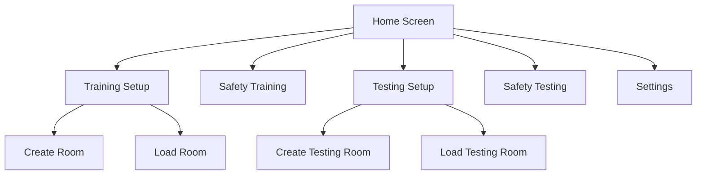
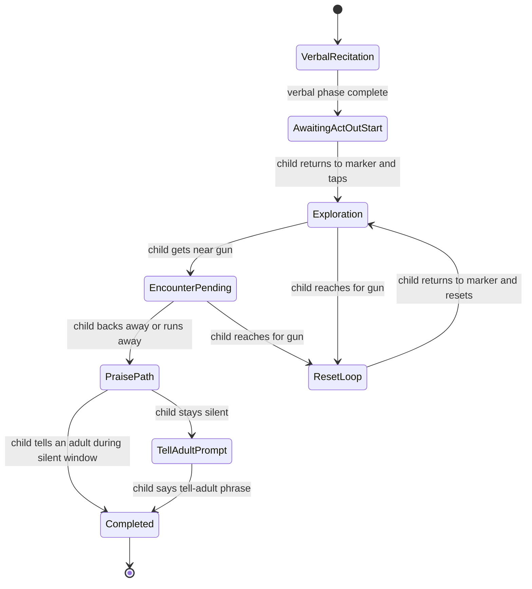
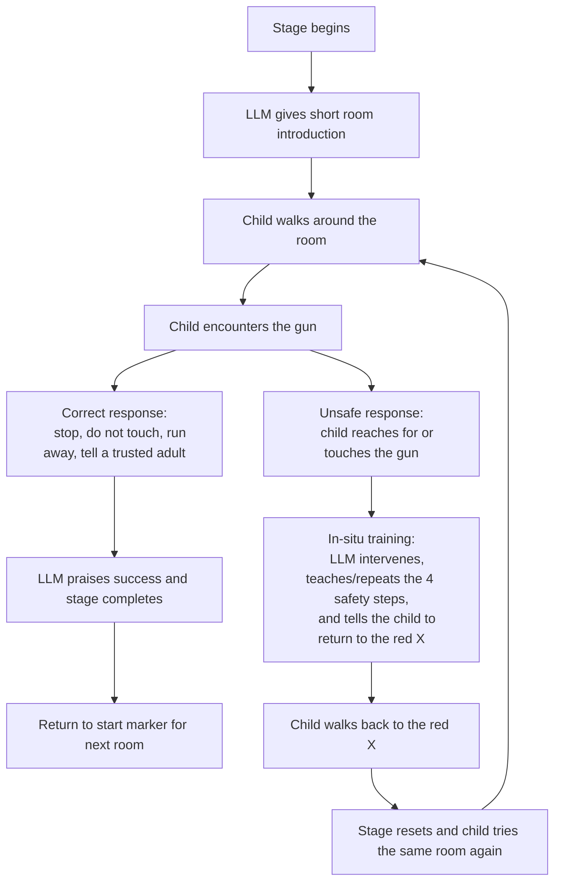
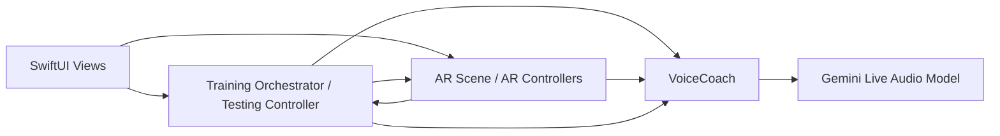
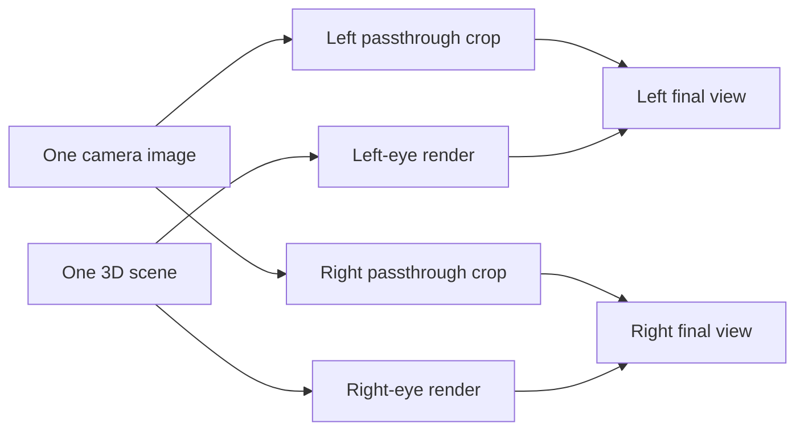

# Child Firearm Safety App: How It Works

## Purpose

This app teaches and assesses firearm safety behaviors in an AR environment. It combines:

- AR room scanning and relocalization
- A live voice coach powered by Gemini
- Runtime orchestration for training and testing flows
- Saved room setups so scenarios can be reused

## App Overview

At a high level, the app has four user-facing areas:

1. `Training Setup`
2. `Safety Training`
3. `Testing Setup`
4. `Safety Testing`

There is also a `Settings` screen for display, recording, knowledge retrieval mode, and Gemini API key management.

## Main User Flows

### 1. Training Setup

Training setup is used to create or load a real AR room for the teaching scenario.

In create mode, the app asks the user to:

- Scan the physical room until mapping quality is high enough
- Place a table in AR
- Auto-place the gun on the table
- Mark the child’s starting position with a floor marker
- Save the room once mapping is stable

In load mode, the app loads a previously saved `ARWorldMap`, restores the saved anchors, and prepares the room for training.

### 2. Safety Training

Safety Training is the guided teaching mode. The flow has two phases:

- `Phase 1: Verbal Recitation`
- `Phase 2: Act-Out`

#### Phase 1: Verbal Recitation

The voice coach begins by asking the child to say the four safety rules:

1. Stop
2. Don’t touch it
3. Run away
4. Tell a trusted adult

If the child does not know them, the coach teaches and rehearses them. When the model determines Phase 1 is complete, it signals completion through a tool call, and the app transitions into the practice-the-steps setup state.

#### Phase 2: Act-Out

Once the child returns to the saved start marker and taps to begin, the app shifts to the physical scenario. The child is expected to:

- Notice the gun
- Avoid touching it
- Move away or run away
- Tell a trusted adult what they found

If the child reaches toward the gun, the app hides the gun, shows the marker again, and runs a reset loop so they can try the scenario again safely.

If the child performs the full sequence successfully, the model signals training completion and the app shows the completion UI.

### 3. Testing Setup

Testing Setup is different from Training Setup.

Instead of placing a single table/gun scene, the app builds a reusable testing environment that supports three scenario stages:

- Kitchen
- Garage
- Bedroom

During setup, the user:

- Scans the room
- Places virtual room content against a wall/floor combination
- Confirms each room asset placement
- Saves the testing room

The saved testing room includes:

- An `ARWorldMap`
- Per-asset transforms for the staged room models
- An optional saved start-camera transform used for reset alignment

### 4. Safety Testing

Safety Testing is the assessment mode. It uses the saved testing room and runs three staged scenarios in sequence:

1. Kitchen
2. Garage
3. Bedroom

For each stage:

- The app loads the current room assets
- The voice coach gives a short in-character cover-story line
- The coach then stays silent unless the child asks a question or does something unsafe
- The child is expected to demonstrate the same safety sequence independently

If the child reaches for the gun:

- The gun is hidden
- The child is asked to repeat the safety rules
- The child returns to the red X
- The stage is reset so they can try again

If the child runs away but does not say the tell-adult phrase, the app waits briefly and then nudges the coach to ask for the final step.

When a stage is successfully completed, the child is directed back to the red X and aligned for the next room. The same stage pattern repeats for kitchen, garage, and bedroom. After the third stage, the testing session ends.

## Core Runtime Architecture

The app is organized around three cooperating subsystems:

- SwiftUI views for navigation and overlays
- AR scene/controllers for world tracking and safety event detection
- Voice/AI services for live conversation and stage completion

The coordination layer between them is mostly a `NotificationCenter` event bus.

## The Voice System

The voice system is centered on `VoiceCoach`.

Its responsibilities are:

- Starting the session
- Managing microphone and speech permissions
- Streaming audio to Gemini Live
- Playing streamed model audio back to the user
- Translating model tool calls into app events
- Injecting runtime context based on what the child does

### How conversation works

1. The app configures the audio session.
2. The microphone starts streaming live audio to Gemini.
3. Gemini returns audio responses and tool calls.
4. The app pauses mic capture while the model is speaking to avoid echo.
5. After playback ends, the app resumes listening.

The model can signal milestones through tool calls rather than text parsing. Those tool calls are used to trigger:

- Verbal training completion
- Full training completion
- Test stage completion
- Intent classification such as “asked what is that” or “called adult”

### RAG support

The voice coach can also inject retrieval-based coaching context from the bundled knowledge base. At runtime the app supports:

- `Semantic` retrieval when a Gemini API key is available
- `TF-IDF` retrieval when local-only mode is enabled or embeddings are unavailable

This retrieval is used as supporting guidance for the coach, not as a standalone user workflow.

## The AR System

The AR side of the app handles:

- World tracking
- Plane detection
- Room save/load
- Object placement
- Start-marker handling
- Distance and retreat tracking
- Hand-pose detection for reach gestures

### Training AR behavior

During training, the AR system detects events such as:

- Child near the gun
- Child reaching for the gun
- Child backing away
- Child running away
- Child arriving at the start marker
- User tap to begin or reset

Those events are posted to the training orchestrator, which decides what the coach should say and whether the gun should be shown, hidden, or reset.

### Testing AR behavior

During testing, the AR system performs similar detection, but the surrounding logic is stage-based instead of phase-based. It also tracks:

- Current active stage
- Start-position alignment between rooms
- Marker-based reset and stage advancement

## Regular Mode vs Stereo Mode

The app supports two very different display pipelines.

### Regular mode

Regular mode is the simpler path. It uses `RealityKit` through a standard `ARView`-based container.

In this mode:

- `ARViewContainer` creates a normal `RealityKit` `ARView`
- `ARCoordinator` manages placement, save/load, gesture detection, and runtime AR events
- The user sees a single camera view with virtual content composited directly by RealityKit

This is the most direct and most natively aligned rendering path in the app.

### Stereo mode

Stereo mode is a custom rendering pipeline built for cardboard-style viewing. It does not use RealityKit for final presentation.

Instead, it uses:

- One shared `ARKit` session
- `SceneKit` for the 3D scene and per-eye camera nodes
- `Metal` for GPU-accelerated camera passthrough rendering
- A custom cardboard mask and reticle overlay

The stereo controller splits the screen into left and right halves, renders the live camera feed into both halves, then draws the 3D scene separately for each eye on top.

### Important limitation: one real camera, not two

The stereo mode is still driven by a single physical device camera. That means it is **not** true binocular capture.

So the app does **not** have:

- Two independent real-world camera viewpoints
- True left/right real-world disparity like a dedicated stereoscopic camera rig
- Perfect depth matching between the camera background and what each human eye would naturally see

Instead, the app creates an approximation by rendering the same camera feed twice with different horizontal cropping/shifting, then matching the virtual 3D projection to those shifted views.

### How the app gets as close as possible

Even though the source camera is monocular, the implementation tries to make the stereo result feel as coherent as possible.

It does that by:

- Rendering the camera feed separately for each eye with a configurable horizontal stereo offset
- Applying asymmetric per-eye projection matrices so virtual objects align with the shifted camera views
- Keeping a separate unshifted detection camera for Vision/gesture math so hand tracking still matches the original camera space
- Using a configurable zero-parallax distance so content can be tuned to sit closer to screen depth instead of feeling over-separated
- Using GPU rendering in Metal to keep the camera passthrough fast enough for realtime stereo presentation
- Layering person segmentation and depth-aware occlusion on top so real people can appear in front of virtual objects when the depth data supports it

One especially important implementation detail is that the left and right virtual eye nodes are kept at the same physical position, while the projection matrices are shifted. In other words, the effect comes from projection/frustum manipulation and per-eye camera cropping rather than from two truly separated captured viewpoints.

### Practical consequence

The result is best understood as a custom stereo approximation:

- Better immersion than a flat single-eye cardboard split
- Stronger 3D separation for virtual content
- More headset-friendly presentation than regular mode
- Still limited by the fact that the real-world passthrough originates from one camera only

So regular mode is the more native and visually faithful AR path, while stereo mode is a carefully tuned custom headset mode that gets as close as possible within the constraints of a single phone camera.

## Data Persistence

The app persists training and testing rooms differently.

### Training room storage

Training rooms are saved as `ARWorldMap` files in the app’s documents directory.

- File pattern: `room_<roomId>.arworldmap`

These maps let the app relocalize into the same real-world room later and restore saved anchors.

### Testing room storage

Testing rooms are saved as two-part data:

- `testing_<roomId>.arworldmap`
- `testing_<roomId>_assets.json`

The testing JSON stores:

- Asset transforms for virtual room pieces
- Optional saved start-camera transform
- Metadata/versioning fields

## Settings

The Settings screen supports a small set of operational controls:

- `Cardboard Viewer Mode`
- `Record Training and Testing`
- `Local Only (TF-IDF)` knowledge retrieval mode
- `Gemini API Key`

### Cardboard mode

When enabled, the app swaps the normal AR presentation for stereo rendering suitable for a cardboard-style headset. This affects both training and testing flows.

### Recording

When enabled, sessions can be recorded automatically. Standard mode uses screen recording, while cardboard mode uses the stereo-capable path.

### Knowledge retrieval mode

The app can operate with:

- Local-only TF-IDF retrieval
- Semantic retrieval using Gemini embeddings when an API key is available

### API key

The Gemini API key is stored locally on-device and is used for live voice interaction and semantic retrieval features.

## Important Design Characteristics

### 1. Training and testing are intentionally separate

Training is guided and corrective. Testing is more silent and observational, with interventions mainly for unsafe behavior or direct questions.

### 2. The event bus keeps systems loosely coupled

AR, orchestration, and voice do not call each other directly in most places. They communicate through notifications, which makes the runtime flow easier to evolve but also means behavior depends heavily on well-defined event names and payloads.

### 3. Reset loops are part of the product design

The app does not treat mistakes as failures. Reaching for the gun triggers a controlled reset loop so the child can rehearse the right response again.

### 4. Room reuse is a core feature

The setup flows are not one-time calibration steps. They create reusable saved environments for repeated training and testing sessions.

## End-to-End Summary

In practical terms, the app works like this:

1. A facilitator creates and saves a room.
2. The app later reloads that room and relocalizes AR content.
3. A child interacts inside the scenario.
4. AR detects what the child physically does.
5. The voice model reacts in real time based on those actions.
6. The orchestrator or testing controller advances, resets, or completes the scenario.

That combination of saved AR context, live voice coaching, and event-driven state management is the core of how the app works.
